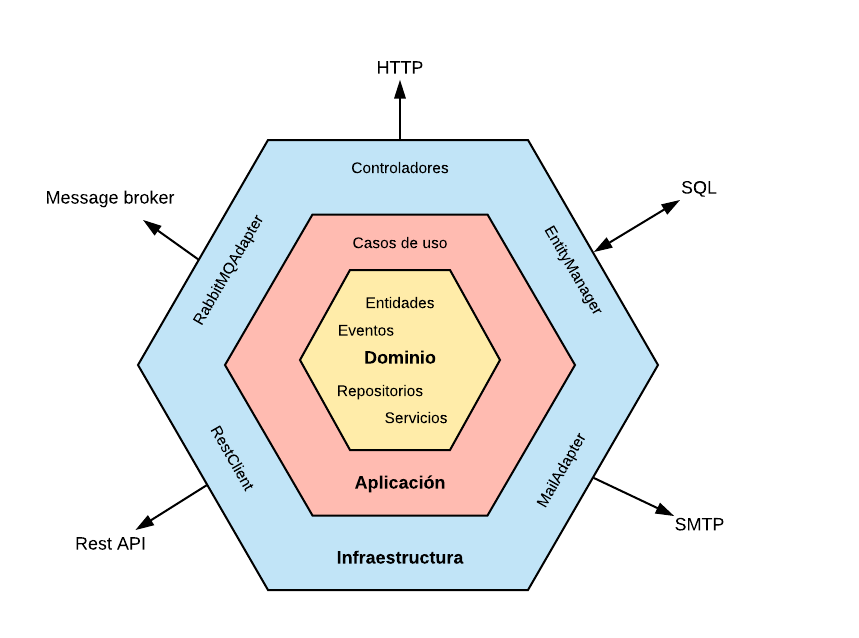

# Transactions Backend

Componente backend basada en las siguientes tecnologías:

- Java 11
- Spring Boot
- JUnit 5

## Hexagonal architecture

## Folder structure

Este es un enfoque basado en DDD que nos separa de los detalles más técnicos y centra los diseños en el negocio.

- main
    - java
        - com.prosegur
            - `bounded context`: Bounded Context, concepto global del dominio sobre el que actual el servicio. En este caso
              tenemos dos, transactional y sharedKernel
                - `agregado`: Concepto de negocio agregado sobre el cual vamos a trabajar, por ejemplo, amount o transaction. 
                    - `domain`: Carpeta de dominio de arquitectura hexagonal. Aquí encontraremos todo lo relacionado con 
                      el domino como entidades, value objects, repositorio (concepto de negocio), servicios de dominio, etc.
                    - `application`: Carpeta de aplicación de la arquitectura hexagonal. Todos los casos de uso relacionados
                      el agregado que la engloba. Principalmente servicios de aplicación y lógica relacionada con el caso de uso
                      específico.
                    - `infrastructure`: Carpeta de infraestructura de arquitectura hexagonal. Todo lo relacionado con entrada-salida, librerías de terceros, etc.
    - resources
        - `schema`: Especificación de las entidades que manejan los servicios externos.
          > Se pueden generan al contruir el componente en el directorio target para el adaptador.
            - `json`
            - `xsd`
        - `log`: Configuración de archivos log que genera la aplicación.
- test

Como podemos ver los conceptos principales de aglutinar las clases con términos de negocio y posteriormente arquitectura hexagonal.
